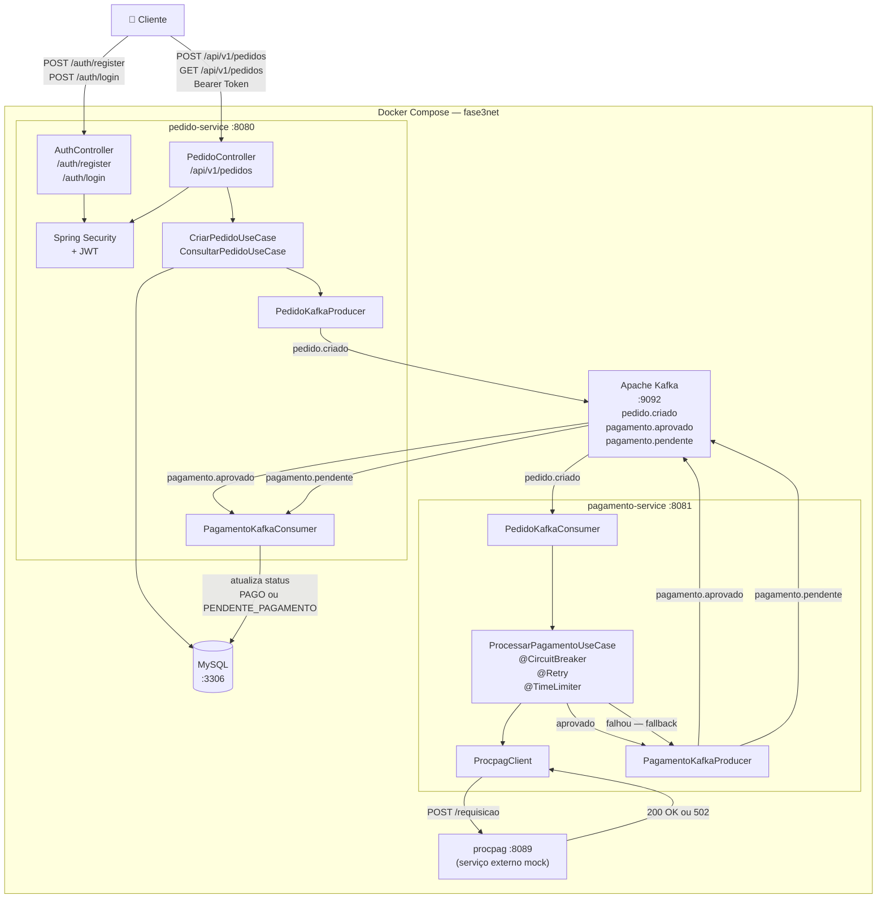

# Tech Challenge 3 — Sistema de Pedidos Online com Arquitetura Distribuída e Resiliência

**Equipe:**
| Nome | RM |
|---|---|
| Eduardo Borges | RM 369948 |
| Heber Mizuno | RM 369455 |
| Patrick Nascimento | RM 369393 |
| Rubens Neto | RM 370154 |

---

## 1. Introdução

### Descrição do Problema

Um grupo de restaurantes contratou estudantes para construir um sistema de gestão compartilhado. O objetivo é permitir que clientes realizem pedidos online, escolhendo restaurantes com base na comida oferecida. O sistema deve ser robusto, resiliente e seguro, capaz de processar pagamentos de forma assíncrona e lidar com falhas de serviços externos.

Esta fase expande o sistema desenvolvido nas fases anteriores, adicionando um fluxo completo de pedidos online com comunicação assíncrona via Kafka, autenticação JWT e resiliência com Resilience4j.

### Objetivo do Projeto

Implementar um conjunto de serviços em Java com Spring Boot para suportar o fluxo completo de pedidos online de um restaurante, incluindo:

- Criação e autenticação de clientes com JWT
- Criação de pedidos com cálculo automático de valor
- Processamento de pagamentos via serviço externo (procpag)
- Comunicação assíncrona entre serviços via Apache Kafka
- Resiliência com Circuit Breaker, Retry, Timeout e Fallback

---

## 2. Arquitetura do Sistema

### Descrição da Arquitetura

O sistema é composto por dois serviços Spring Boot independentes que se comunicam de forma assíncrona via Apache Kafka, além de um serviço externo de pagamento fornecido pelos professores.

**Serviços:**

- **pedido-service** (porta 8080): responsável por autenticação JWT, cadastro de clientes, criação e consulta de pedidos. Publica eventos no Kafka e consome eventos de pagamento para atualizar o status dos pedidos.
- **pagamento-service** (porta 8081): consome eventos do Kafka, processa pagamentos chamando o serviço externo procpag e publica o resultado de volta no Kafka.
- **procpag** (porta 8089): serviço mock externo fornecido pelos professores. Simula um serviço eventualmente disponível que processa pagamentos.

**Infraestrutura:**

- **Apache Kafka + Zookeeper**: mensageria assíncrona entre os serviços
- **MySQL**: banco de dados compartilhado
- **Docker Compose**: orquestra todos os serviços em um único comando

**Padrão arquitetural:**

Ambos os serviços seguem Clean Architecture com as camadas:

```
core/
  domain/     → entidades e regras de negócio
  usecase/    → casos de uso
  gateway/    → interfaces (ports)
infra/
  controller/ → endpoints REST
  gateway/    → implementações (adapters)
  kafka/      → producers e consumers
  client/     → clientes HTTP externos
```

### Diagrama da Arquitetura



### Fluxo Principal de Funcionamento

```
1. Cliente se cadastra via POST /auth/register
   → role CLIENTE atribuído automaticamente
   → senha armazenada com BCrypt

2. Cliente faz login via POST /auth/login
   → retorna token JWT com ID do cliente no payload

3. Cliente cria pedido via POST /api/v1/pedidos (Bearer token)
   → clienteId extraído do token JWT
   → preços buscados do banco (não aceitos do cliente)
   → valorTotal calculado pelo sistema
   → pedido salvo com status AGUARDANDO_CONFIRMACAO
   → evento pedido.criado publicado no Kafka

4. pagamento-service consome pedido.criado
   → chama procpag em http://procpag:8089/requisicao
   → se aprovado: publica pagamento.aprovado
   → se falhou: aciona fallback → publica pagamento.pendente

5. pedido-service consome pagamento.aprovado
   → atualiza status do pedido para PAGO

5b. pedido-service consome pagamento.pendente
    → atualiza status do pedido para PENDENTE_PAGAMENTO
    → worker reprocessa automaticamente quando procpag voltar

6. Cliente consulta status via GET /api/v1/pedidos/{id}
```

---

## 3. Descrição dos Endpoints da API

### Tabela de Endpoints

#### Autenticação (público — sem token)

| Endpoint | Método | Descrição |
|---|---|---|
| `/auth/register` | POST | Cadastra novo cliente com role CLIENTE automático |
| `/auth/login` | POST | Autentica cliente e retorna token JWT |

#### Pedidos (protegido — requer Bearer token)

| Endpoint | Método | Descrição |
|---|---|---|
| `/api/v1/pedidos` | POST | Cria novo pedido com itens e calcula valor total |
| `/api/v1/pedidos` | GET | Lista todos os pedidos do cliente autenticado |
| `/api/v1/pedidos/{id}` | GET | Consulta pedido específico por ID |

### Exemplos de Requisição e Resposta

#### POST /auth/register

**Request:**
```json
{
  "nome": "João Silva",
  "email": "joao@email.com",
  "senha": "senha123"
}
```

**Response 201:**
```json
{
  "id": 1,
  "nome": "João Silva",
  "email": "joao@email.com",
  "tipoUsuario": { "id": 2, "nome": "Cliente" }
}
```

**Response 400 — senha muito curta:**
```json
{ "status": 400, "mensagem": "Senha deve ter no minimo 6 caracteres" }
```

---

#### POST /auth/login

**Request:**
```json
{
  "email": "joao@email.com",
  "senha": "senha123"
}
```

**Response 200:**
```json
{
  "token": "eyJhbGciOiJIUzI1NiJ9...",
  "tipo": "Bearer",
  "clienteId": 1,
  "nome": "João Silva"
}
```

**Response 401 — credenciais inválidas:**
```json
{ "status": 401, "mensagem": "Email ou senha invalidos" }
```

---

#### POST /api/v1/pedidos

**Request:**
```http
Authorization: Bearer {token}
```
```json
{
  "restauranteId": 1,
  "itens": [
    { "itemCardapioId": 1, "quantidade": 2 },
    { "itemCardapioId": 3, "quantidade": 1 }
  ]
}
```

**Response 201:**
```json
{
  "id": 10,
  "valorTotal": 32.00
}
```

**Response 401 — sem token:**
```json
{ "status": 401, "mensagem": "Token JWT ausente ou invalido" }
```

---

#### GET /api/v1/pedidos/{id}

**Request:**
```http
Authorization: Bearer {token}
```

**Response 200 — pedido PAGO:**
```json
{
  "id": 10,
  "clienteId": 1,
  "restauranteId": 1,
  "valorTotal": 32.00,
  "status": "PAGO",
  "itens": [
    { "id": 1, "itemCardapioId": 1, "nome": "Coxinha de Frango", "quantidade": 2, "preco": 8.50 },
    { "id": 2, "itemCardapioId": 3, "nome": "Pudim de Leite", "quantidade": 1, "preco": 15.00 }
  ]
}
```

**Response 200 — pedido PENDENTE_PAGAMENTO (procpag indisponível):**
```json
{
  "id": 10,
  "status": "PENDENTE_PAGAMENTO",
  "valorTotal": 32.00
}
```

**Response 403 — pedido de outro cliente:**
```json
{ "status": 403, "mensagem": "Acesso negado — este pedido nao pertence ao cliente autenticado" }
```

---

#### GET /api/v1/pedidos

**Request:**
```http
Authorization: Bearer {token}
```

**Response 200:**
```json
[
  {
    "id": 10,
    "clienteId": 1,
    "restauranteId": 1,
    "valorTotal": 32.00,
    "status": "PENDENTE_PAGAMENTO",
    "itens": [...]
  },
  {
    "id": 11,
    "clienteId": 1,
    "restauranteId": 1,
    "valorTotal": 45.90,
    "status": "PAGO",
    "itens": [...]
  }
]
```

---

## 4. Configuração do Projeto

### Configuração do Docker Compose

O arquivo `docker-compose.yml` na raiz do projeto orquestra todos os serviços necessários na rede `fase3net`:

| Serviço | Imagem | Porta | Descrição |
|---|---|---|---|
| `techchallenge3-mysql` | mysql:8.0 | 3306 | Banco de dados |
| `techchallenge3-zookeeper` | cp-zookeeper:7.4.0 | 2181 | Coordenador do Kafka |
| `techchallenge3-kafka` | cp-kafka:7.4.0 | 9092 / 29092 | Mensageria |
| `techchallenge3-app` | build local | 8080 | pedido-service |
| `techchallenge3-pagamento` | build local | 8081 | pagamento-service |
| `procpag` | erickemprobr/procpag | 8089 | Mock de pagamento externo |

**Dependências na inicialização:**

```
MySQL (health check) → pedido-service
Zookeeper → Kafka → pedido-service e pagamento-service
procpag → pagamento-service
```

### Instruções para Execução Local

**Pré-requisitos:** Docker Desktop instalado e em execução.

**1. Clone o repositório:**
```bash
git clone https://github.com/patrickiub/tech-challenge3
cd tech-challenge3
```

**2. Suba todos os serviços com um único comando:**
```bash
docker compose up --build
```

**3. Aguarde todos os serviços iniciarem. URLs disponíveis:**

| Serviço | URL |
|---|---|
| pedido-service | http://localhost:8080 |
| pagamento-service | http://localhost:8081 |
| procpag (mock) | http://localhost:8089 |
| procpag OpenAPI | http://localhost:8089/openapi.yml |
| MySQL | localhost:3306 |
| Kafka | localhost:29092 |

**4. Para encerrar:**
```bash
docker compose down
```

**5. Para encerrar e limpar volumes (banco de dados):**
```bash
docker compose down -v
```

---

## 5. Qualidade do Código

### Boas Práticas Utilizadas

**Clean Architecture:**
Ambos os serviços seguem a separação estrita de camadas — o `core` (domain e usecase) não conhece nada da infraestrutura. Controllers, repositories e producers/consumers Kafka ficam na camada `infra`, comunicando-se com o core apenas por interfaces (ports/gateways).

**SOLID:**
- *Single Responsibility*: cada UseCase trata de um único caso de uso
- *Dependency Inversion*: UseCases dependem de interfaces (ex: `PedidoGateway`, `PedidoEventPublisher`), não de implementações concretas
- *Open/Closed*: novos comportamentos adicionados via novas implementações, sem modificar o core

**Segurança:**
- Senhas armazenadas com BCrypt (nunca em texto puro)
- `clienteId` sempre extraído do token JWT, nunca aceito pelo body da requisição
- Endpoints protegidos retornam 401 sem token e 403 sem permissão

**Resiliência:**
- Circuit Breaker, Retry e Timeout configurados via Resilience4j
- Fallback garante que pedidos nunca falham mesmo com procpag indisponível
- Worker de reprocessamento automático recupera pedidos pendentes

**Conventional Commits:**
Histórico de commits organizado seguindo o padrão `feat`, `fix`, `refactor`, `chore`, `docs`.

---

## 6. Pontos de Resiliência

O sistema foi projetado para nunca deixar um pedido falhar, mesmo com o serviço de pagamento externo indisponível.

### Circuit Breaker (Resilience4j)

Configurado na chamada ao procpag no `pagamento-service`:

```yaml
resilience4j:
  circuitbreaker:
    instances:
      procpag:
        slidingWindowSize: 10
        failureRateThreshold: 50        # abre com 50% de falhas
        waitDurationInOpenState: 10s    # aguarda 10s antes de tentar novamente
        permittedNumberOfCallsInHalfOpenState: 3
```

**Estados:**
- `FECHADO` → chamadas normais ao procpag
- `ABERTO` → bloqueia chamadas, aciona fallback direto
- `MEIO-ABERTO` → testa recuperação com 3 chamadas

### Retry

```yaml
resilience4j:
  retry:
    instances:
      procpag:
        maxAttempts: 3      # até 3 tentativas
        waitDuration: 2s    # aguarda 2s entre tentativas
```

### Timeout

```yaml
resilience4j:
  timelimiter:
    instances:
      procpag:
        timeoutDuration: 3s  # cancela se demorar mais de 3s
```

### Fallback

Quando todas as proteções falharem, o fallback:
1. Salva o pagamento com status `PENDENTE` no banco
2. Publica evento `pagamento.pendente` no Kafka
3. Retorna resposta sem lançar exceção (pedido não falha)

### Worker de Reprocessamento

O `pagamento-service` consome o tópico `pagamento.pendente` e tenta processar novamente quando o procpag estiver disponível. Após confirmação, publica `pagamento.aprovado` e o pedido é atualizado para `PAGO` automaticamente.

---

## 7. Eventos Kafka

| Tópico | Publicado por | Consumido por | Quando |
|---|---|---|---|
| `pedido.criado` | pedido-service | pagamento-service | Ao criar um pedido |
| `pagamento.aprovado` | pagamento-service | pedido-service | procpag retorna 200 |
| `pagamento.pendente` | pagamento-service | pedido-service + worker | procpag indisponível |

---

## 8. Collections para Teste

### Importar no Postman

O arquivo de collection está disponível em `/postman/postman_collection.json` no repositório.

**Para importar:**
1. Abra o Postman
2. Clique em **Import**
3. Selecione o arquivo `postman_collection.json`
4. A collection **"Tech Challenge — API REST (Fase 2 + Fase 3)"** será importada

### Como Usar

A collection está dividida em pastas **Fase 2** e **Fase 3**.

**Fluxo recomendado para testar a Fase 3:**

1. Execute **"Register — Cadastrar cliente"** para criar um usuário
2. Execute **"Login — Obter token JWT"** — o token é salvo automaticamente na variável `{{token}}`
3. Execute **"Criar pedido"** — o token é usado automaticamente no header
4. Aguarde alguns segundos e execute **"Consultar pedido por ID"** para ver o status (`PAGO` ou `PENDENTE_PAGAMENTO`)
5. Execute **"Listar meus pedidos"** para ver todos os pedidos do cliente

> **Nota:** O procpag é um serviço eventualmente disponível — às vezes retorna 502 (Bad Gateway) por design. Quando isso ocorre, o pedido fica como `PENDENTE_PAGAMENTO` e é reprocessado automaticamente quando o procpag volta a funcionar.

Cada endpoint possui exemplos salvos de respostas de sucesso (✅) e erro (❌) para referência.

---

## 9. Repositório do Código

| Item | URL |
|---|---|
| Repositório principal | https://github.com/patrickiub/tech-challenge3 |
| pedido-service | `/src` na raiz do repositório |
| pagamento-service | `/pagamento-service` no repositório |
| docker-compose.yml | `/docker-compose.yml` na raiz |
| Collection Postman | `/postman/postman_collection.json` |

---

## 10. Status dos Pedidos

| Status | Descrição |
|---|---|
| `AGUARDANDO_CONFIRMACAO` | Pedido criado, aguardando processamento do Kafka |
| `PAGO` | Pagamento aprovado pelo procpag |
| `PENDENTE_PAGAMENTO` | procpag indisponível, aguardando reprocessamento automático |
| `CONFIRMADO` | Pedido confirmado pelo cliente |

---

## 11. Vídeo de Apresentação

[](https://www.youtube.com/watch?v=4qqIDYxtOU8)

🔗 https://www.youtube.com/watch?v=4qqIDYxtOU8